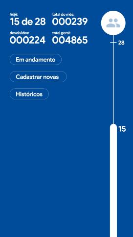
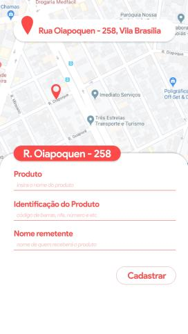
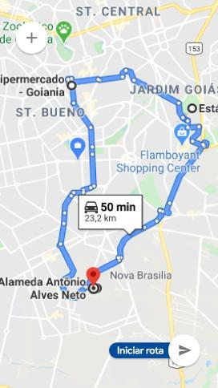
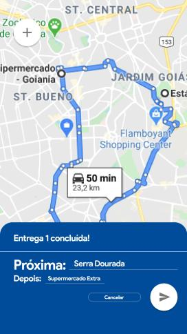
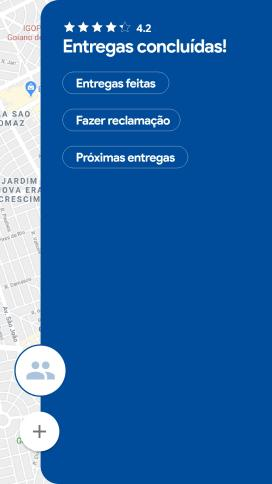

  

### Amálgama / Logística

#### Execução

`$ npm install`  
`$ expo start`

#### Apresentação 

  Atualmente nos sistemas de entregas, como clientes enfrentamos o problema de não conseguir rastrear nossa entrega de ponta a ponta em tempo real, ficando sem como se planejar.  Como fornecedores enfrentamos o problema de não ter a melhor rota para as nossas entregas e não oferecer transparência aos nossos clientes, acarretando falta de eficiência no processo e insatisfação do usuário. A solução SEGUI propõe resolver esses dois problemas, para os fornecedores traçar a melhor rota e maior controle das suas entregas e para os clientes transparência com um rastreio em tempo real.

#### O Produto

  
  
  
  
  
  
  
  
  
  
  

